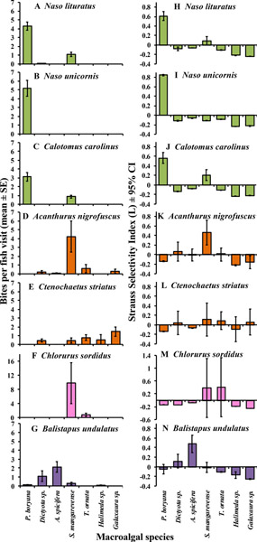

```{r}
#| include: false

# Loading libraries
library(tidyverse)
library(patchwork)

```


### Exercise 1: Plot Deconstruction

#### Selected Data

Figure 2 from *Selective consumption of macroalgal species by herbivorous fishes suggests reduced functional complementarity on a fringing reef in Moorea, French Polynesia* (Sura et al., 2021)
```{r}
#| echo: false
#| out-width: "40%"


```


#### Visual Critique

**Message:** The figure demonstrates species-specific feeding by herbivorous reef fishes, with different fishes showing distinct consumption rates and selectivity among macroalgal taxa. This suggests limited functional redundancy among herbivores and indicates that individual fish species may have different roles in regulating macroalgal communities.

**Flaws:** The use of mean ± SE bar charts obscures the distribution of the underlying observations, including potential variation, zero-inflation and outliers in feeding behaviour. Points and uncertainty intervals, ideally accompanied by the raw observations, would represent the data more transparently. Second, dividing the results among 14 small panels makes comparisons among fish and macroalgal species difficult. Repeated axes, labels and panel headings create visual clutter, while the rotated macroalgal labels appear only at the bottom of the figure. The colour scheme also provides largely redundant information because colour distinguishes fish that are already separated and labelled by panel.


```{r}
#| message: false
#| output: false
#| code-fold: true
#| echo: false

sura <- read_csv("../data/workshop3/sura_figure2_digitised_approx.csv")

glimpse(sura)

sura <- sura %>%
  mutate(
    algae_label = factor(
      macroalgae,
      levels = c(
        "Padina boryana",
        "Dictyota sp.",
        "Acanthophora spicifera",
        "Sargassum mangarevense",
        "Turbinaria ornata",
        "Galaxaura sp.",
        "Halimeda sp."
      ),
      labels = c(
        "P. boryana",
        "Dictyota sp.",
        "A. spicifera",
        "S. mangarevense",
        "T. ornata",
        "Galaxaura sp.",
        "Halimeda sp."
      )
    ),
    fish_species = factor(
      fish_species,
      levels = c(
        "Naso lituratus",
        "Naso unicornis",
        "Calotomus carolinus",
        "Acanthurus nigrofuscus",
        "Ctenochaetus striatus",
        "Chlorurus sordidus",
        "Balistapus undulatus"
      )
    )
  )
```
#### Reconstructed Data

The reconstructed dataset contains the mean feeding intensity and uncertainty for each combination of seven fish species and seven macroalgal taxa. Feeding intensity is represented as mean bites per fish visit ± SE, while feeding selectivity is represented by the mean Strauss selectivity index and 95% confidence interval.

<details>
<summary><strong>View reconstructed data table</strong></summary>

```{r}
#| fig-width: 10
#| fig-height: 14
#| echo: false
#| message: false
#| code-fold: true

plot_table <- sura %>%
  transmute(
    `Fish species` = paste0("*", as.character(fish_species), "*"),
    `Macroalga` = case_when(
      algae_label == "P. boryana" ~ "*P. boryana*",
      algae_label == "Dictyota sp." ~ "*Dictyota* sp.",
      algae_label == "A. spicifera" ~ "*A. spicifera*",
      algae_label == "S. mangarevense" ~ "*S. mangarevense*",
      algae_label == "T. ornata" ~ "*T. ornata*",
      algae_label == "Galaxaura sp." ~ "*Galaxaura* sp.",
      algae_label == "Halimeda sp." ~ "*Halimeda* sp."
    ),
    `Bites per visit (mean ± SE)` = sprintf(
      "%.2f ± %.2f",
      bites_mean,
      (bites_se_upper - bites_se_lower) / 2
    ),
    `Strauss selectivity (mean, 95% CI)` = sprintf(
      "%.2f (%.2f, %.2f)",
      selectivity_mean,
      selectivity_ci95_lower,
      selectivity_ci95_upper
    )
  )

knitr::kable(
  plot_table,
  align = c("l", "l", "c", "c"),
  caption = "Approximate values used to reconstruct and redesign Figure 2 from Sura et al."
)
```
</details>

Note: Values are approximate summary statistics manually extracted from Figure 2 of Sura et al. and do not represent the authors' original raw observations. Bites are presented as mean ± SE and Strauss selectivity as mean (95% CI).

#### Figure Redesign
The figure was redesigned to improve comparisons among fish species and macroalgal taxa while reducing visual clutter. Bars were replaced with points and horizontal uncertainty intervals, cleaning it up while retaining information about the estimated means and their uncertainty. Macroalgal names were moved to the y-axis and abbreviated to improve readability, and the redundant colour scheme was removed.

Feeding intensity and selectivity were retained as separate panels because they represent different ecological information. Feeding-intensity panels use independent x-axis scales to make within-species feeding patterns visible despite large differences in bite rates among fishes. In contrast, the selectivity panels retain a common x-axis scale and a zero reference line, allowing direct comparison among species. Positive Strauss selectivity values indicate selection for a macroalga, whereas negative values indicate avoidance.

```{r}
#| fig-width: 10
#| fig-height: 14
#| echo: false
#| message: false
#| code-fold: true

# Panel A: Feeding intensity
p_bites <- ggplot(
  sura,
  aes(x = bites_mean, y = algae_label)
) +
  geom_errorbar(
    aes(
      xmin = bites_se_lower,
      xmax = bites_se_upper
    ),
    width = 0.12,
    linewidth = 0.45
  ) +
  geom_point(size = 2) +
  facet_wrap(
    ~ fish_species,
    ncol = 1,
    scales = "free_x"
  ) +
  scale_y_discrete(limits = rev) +
  labs(
    title = "Feeding intensity",
    x = "Bites per fish visit",
    y = NULL
  ) +
  theme_minimal(base_size = 10) +
  theme(
    plot.title = element_text(
      face = "bold",
      size = 13,
      hjust = 0.5,
      margin = margin(b = 8)
    ),
    strip.text = element_text(
      face = "italic"
    ),
    panel.grid.minor = element_blank(),
    panel.grid.major.y = element_blank()
  )


# Panel B: Feeding selectivity
p_selectivity <- ggplot(
  sura,
  aes(x = selectivity_mean, y = algae_label)
) +
  geom_vline(
    xintercept = 0,
    linewidth = 0.5
  ) +
  geom_errorbar(
    aes(
      xmin = selectivity_ci95_lower,
      xmax = selectivity_ci95_upper
    ),
    width = 0.12,
    linewidth = 0.45
  ) +
  geom_point(size = 2) +
  facet_wrap(
    ~ fish_species,
    ncol = 1
  ) +
  scale_y_discrete(limits = rev) +
  labs(
    title = "Feeding selectivity",
    x = "Strauss selectivity index",
    y = NULL
  ) +
  theme_minimal(base_size = 10) +
  theme(
    plot.title = element_text(
      face = "bold",
      size = 13,
      hjust = 0.5,
      margin = margin(b = 8)
    ),
    strip.text = element_text(
      face = "italic"
    ),
    panel.grid.minor = element_blank(),
    panel.grid.major.y = element_blank()
  )


# Combine the two panels
final_plot <- (p_bites | p_selectivity) +
  plot_annotation(
    tag_levels = "A"
  ) &
  theme(
    plot.tag = element_text(
      face = "bold",
      size = 14
    )
  )

final_plot
```
**Figure 1.** Redesigned visualisation of feeding intensity and macroalgal selectivity among seven herbivorous reef fishes. (A) Points represent mean bites per fish visit and horizontal error bars represent ± SE. Note that x-axis scales vary among fish species to emphasise within-species feeding patterns. (B) Points represent mean Strauss selectivity indices and horizontal error bars represent 95% confidence intervals. The vertical line at zero represents neutral selection; positive values indicate selection and negative values indicate avoidance. Data are approximate values manually reconstructed from Figure 2 of Sura et al.

#### Reflection
The redesign makes species-specific feeding patterns more apparent while preserving the distinction between feeding intensity and selectivity. In particular, the shared selectivity scale and zero reference line make differences in preference and avoidance easier to interpret across fish species. Replacing bars with points also reduces visual clutter and places greater emphasis on the estimates and their uncertainty. However, because the original raw observations were unavailable, the redesign cannot address the loss of information caused by presenting only summary statistics. Access to the original fish-visit-level data would allow the underlying distributions and variation in feeding behaviour to be visualised directly.

### Exercise 2: Queensland Fisheries Data Discovery Challenge

```{r}
qfish_raw <- read_csv(
  "../data/workshop3/commercial_fishing_species_raw.csv"
)

glimpse(qfish_raw)
names(qfish_raw)
qfish_raw %>%
  count(YearType)

qfish <- qfish_raw %>%
  filter(YearType == "Calendar") %>%
  select(
    Fishery,
    Region,
    Year,
    SpeciesCommonName,
    Licences,
    Days,
    Catch_Kg,
    Catch_T
  )
glimpse(qfish)

range(qfish$Year, na.rm = TRUE)

qfish %>%
  count(Year) %>%
  arrange(Year)

qfish %>%
  count(SpeciesCommonName, sort = TRUE) %>%
  print(n = 50)

qfish %>%
  filter(str_detect(
    SpeciesCommonName,
    regex("coral trout", ignore_case = TRUE)
  )) %>%
  distinct(
    Fishery,
    Region,
    SpeciesCommonName
  ) %>%
  arrange(
    SpeciesCommonName,
    Region
  )

spanish_mackerel <- qfish %>%
  filter(SpeciesCommonName == "Mackerel - spanish")

spanish_mackerel %>%
  distinct(
    Fishery,
    Region
  )

spanish_mackerel %>%
  group_by(Fishery, Region) %>%
  summarise(
    first_year = min(Year),
    last_year = max(Year),
    n_years = n_distinct(Year),
    .groups = "drop"
  )

spanish_mackerel %>%
  select(
    Fishery,
    Region,
    Year,
    Catch_T,
    Days,
    Licences
  ) %>%
  arrange(Region, Year) %>%
  print(n = 100)

mackerel_line <- qfish %>%
  filter(
    SpeciesCommonName == "Mackerel - spanish",
    Fishery == "Line",
    Region %in% c("East Coast", "GOC"),
    Year <= 2025
  ) %>%
  mutate(
    Region = recode(
      Region,
      "GOC" = "Gulf of Carpentaria"
    )
  ) %>%
  arrange(Region, Year)

glimpse(mackerel_line)

mackerel_line %>%
  select(
    Region,
    Year,
    Catch_T,
    Days,
    Licences
  )

ggplot(
  mackerel_line,
  aes(
    x = Year,
    y = Catch_T,
    colour = Region
  )
) +
  geom_line(linewidth = 1) +
  geom_point(size = 2) +
  labs(
    x = "Year",
    y = "Commercial catch (tonnes)",
    colour = "Region"
  ) +
  theme_minimal()

ggplot(
  mackerel_line,
  aes(
    x = Year,
    y = Days,
    colour = Region
  )
) +
  geom_line(linewidth = 1) +
  geom_point(size = 2) +
  labs(
    x = "Year",
    y = "Reported fishing days",
    colour = "Region"
  ) +
  theme_minimal()

mackerel_line <- qfish %>%
  filter(
    SpeciesCommonName == "Mackerel - spanish",
    Fishery == "Line",
    Region %in% c("East Coast", "GOC"),
    Year <= 2025
  ) %>%
  mutate(
    Year = as.numeric(Year),
    Region = recode(
      Region,
      "GOC" = "Gulf of Carpentaria"
    )
  ) %>%
  arrange(Region, Year)

mackerel_line <- qfish %>%
  filter(
    SpeciesCommonName == "Mackerel - spanish",
    Fishery == "Line",
    Region %in% c("East Coast", "GOC")
  ) %>%
  mutate(
    Year = as.numeric(Year),
    Region = recode(
      Region,
      "GOC" = "Gulf of Carpentaria"
    )
  ) %>%
  filter(Year <= 2025) %>%
  arrange(Region, Year)

p_catch <- ggplot(
  mackerel_line,
  aes(
    x = Year,
    y = Catch_T,
    colour = Region
  )
) +
  geom_line(linewidth = 1) +
  geom_point(size = 2.2) +
  scale_x_continuous(
    breaks = seq(2008, 2024, by = 4)
  ) +
  labs(
    title = "A. Commercial catch",
    x = NULL,
    y = "Catch (tonnes)",
    colour = "Region"
  ) +
  theme_minimal(base_size = 11) +
  theme(
    plot.title = element_text(face = "bold"),
    panel.grid.minor = element_blank(),
    legend.position = "top"
  )

p_effort <- ggplot(
  mackerel_line,
  aes(
    x = Year,
    y = Days,
    colour = Region
  )
) +
  geom_line(linewidth = 1) +
  geom_point(size = 2.2) +
  scale_x_continuous(
    breaks = seq(2008, 2024, by = 4)
  ) +
  labs(
    title = "B. Fishing effort",
    x = "Calendar year",
    y = "Reported fishing days",
    colour = "Region"
  ) +
  theme_minimal(base_size = 11) +
  theme(
    plot.title = element_text(face = "bold"),
    panel.grid.minor = element_blank(),
    legend.position = "top"
  )
```

```{r}
#| fig-width: 9
#| fig-height: 7
#| echo: false

# Commercial catch
p_catch <- ggplot(
  mackerel_line,
  aes(
    x = Year,
    y = Catch_T,
    colour = Region
  )
) +
  geom_line(linewidth = 1) +
  geom_point(size = 2.2) +
  scale_x_continuous(
    breaks = seq(2008, 2024, by = 4)
  ) +
  labs(
    title = "A. Commercial catch",
    x = NULL,
    y = "Catch (tonnes)",
    colour = "Region"
  ) +
  theme_minimal(base_size = 11) +
  theme(
    plot.title = element_text(face = "bold"),
    panel.grid.minor = element_blank(),
    legend.position = "top"
  )

# Fishing effort
p_effort <- ggplot(
  mackerel_line,
  aes(
    x = Year,
    y = Days,
    colour = Region
  )
) +
  geom_line(linewidth = 1) +
  geom_point(size = 2.2) +
  scale_x_continuous(
    breaks = seq(2008, 2024, by = 4)
  ) +
  labs(
    title = "B. Fishing effort",
    x = "Calendar year",
    y = "Reported fishing days",
    colour = "Region"
  ) +
  theme_minimal(base_size = 11) +
  theme(
    plot.title = element_text(face = "bold"),
    panel.grid.minor = element_blank(),
    legend.position = "top"
  )

# Combine into final figure
final_mackerel_plot <-
  (p_catch / p_effort) +
  plot_layout(guides = "collect") +
  plot_annotation(
    title = "Commercial Spanish mackerel catch and fishing effort",
    subtitle = "Queensland East Coast and Gulf of Carpentaria line fisheries, 2007–2025"
  ) &
  theme(
    legend.position = "top",
    plot.title = element_text(face = "bold")
  )

final_mackerel_plot
```

Figure 1. Commercial Spanish mackerel catch and fishing effort in Queensland line fisheries, 2007–2025. (A) Reported annual commercial catch of Spanish mackerel (Scomberomorus commerson) in the East Coast and Gulf of Carpentaria regions. (B) Reported fishing effort, measured as fishing days, for the same fisheries and regions. East Coast catch declined substantially after 2021 alongside a reduction in reported fishing effort, while Gulf of Carpentaria catch and effort were comparatively stable through much of the time series before declining in 2025. Data: Queensland Fisheries QFISH Commercial Fishing Annual Species Summary Data.

(BEFORE FIGURE)
Management question. How have reported commercial Spanish mackerel catches and fishing effort changed between Queensland's East Coast and Gulf of Carpentaria line fisheries from 2007 to 2025?
Commercial catch records were obtained from the Queensland Fisheries QFISH Commercial Fishing Annual Species Summary dataset. Calendar-year records for Spanish mackerel were filtered to the Line fishery and the East Coast and Gulf of Carpentaria regions. Statewide (QLD) records were excluded because they aggregate regional catches and would therefore duplicate observations included in the regional data. Records for 2026 were also excluded because the current year represents an incomplete reporting period.

(AFTER FIGURE)
Key finding. East Coast Spanish mackerel catch and fishing effort both declined markedly after 2021. Reported catch decreased from approximately 280 tonnes in 2021 to 118 tonnes in 2025, while fishing effort declined from approximately 4,100 to 2,100 fishing days over the same period. Gulf of Carpentaria catch and effort showed a different temporal pattern, remaining comparatively variable but without the same sustained decline through most of the series. Because total catch is influenced by fishing effort as well as fish availability, these trends should not be interpreted as direct measures of Spanish mackerel abundance.
